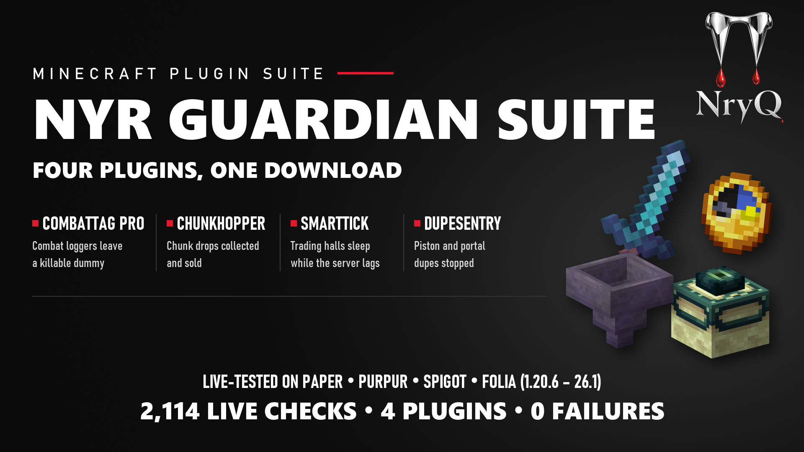
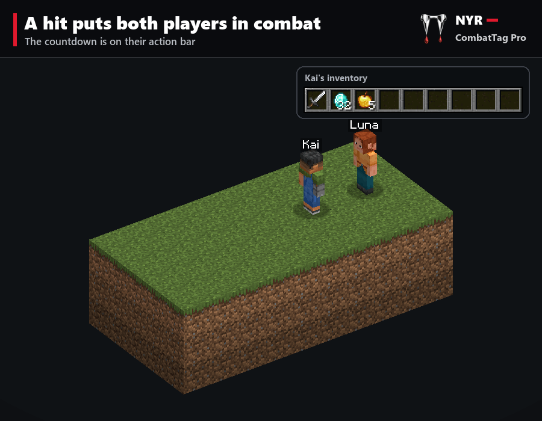
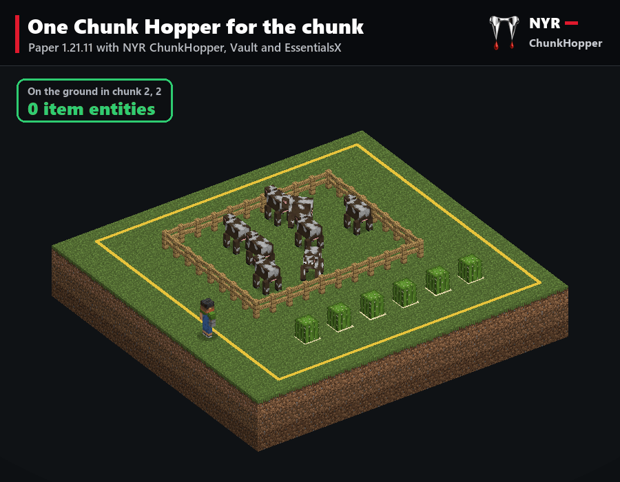
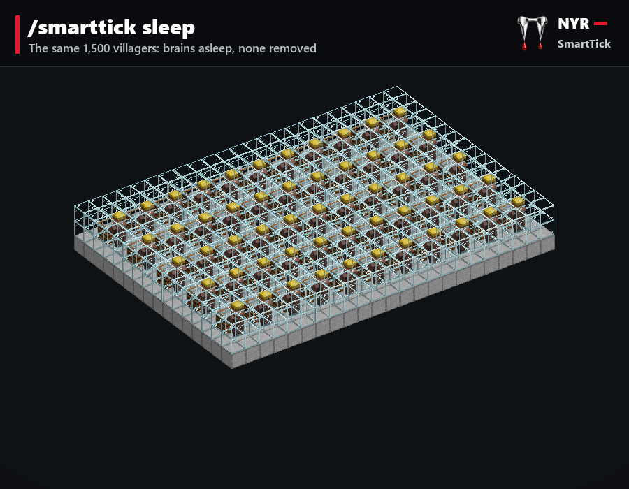
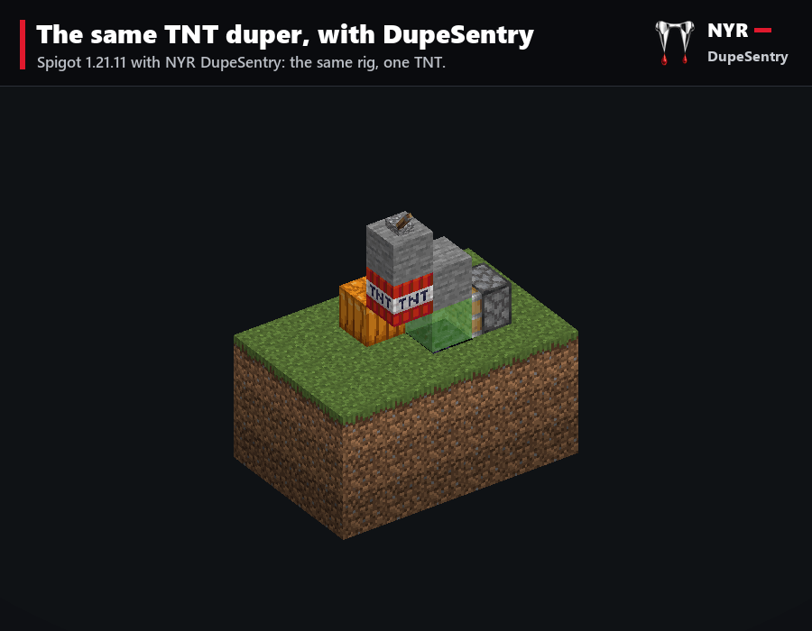

<p align="center">
  
</p>

# NYR Guardian

Four plugins for Paper, Purpur, Folia and Spigot servers. Between them they handle combat logging, drops piling up in
farm chunks, lag from trading halls and mechanical dupes. Each plugin is sold as its own download, and the NYR Guardian
Suite download holds all four.

| Plugin | What it does | Command | Download |
|---|---|---|---|
| [NYR CombatTag Pro](#nyr-combattag-pro) | Tags players hit in PvP. A player who logs out in combat leaves a killable dummy that carries their items. | `/combattag` | `NYR-CombatTagPro-1.0.0.zip` |
| [NYR ChunkHopper](#nyr-chunkhopper) | One hopper per chunk collects every drop in that chunk the moment it drops. It can filter what it keeps and sell it. | `/chunkhopper` | `NYR-ChunkHopper-1.0.0.zip` |
| [NYR SmartTick](#nyr-smarttick) | When the server falls behind, villagers' brains in trading halls sleep until it recovers. It removes nothing. | `/smarttick` | `NYR-SmartTick-1.0.0.zip` |
| [NYR DupeSentry](#nyr-dupesentry) | Stops piston TNT, carpet and rail dupers, falling-block end portal dupes and tripwire hook duplicators. It also closes container screens whose container is gone. | `/dupesentry` | `NYR-DupeSentry-1.0.0.zip` |
| NYR Guardian Suite | All four plugins in one download. | | `NYR-GuardianSuite-1.0.0.zip` |

Each download has a buyer's guide, which is the full manual for that plugin. The source of each guide is
`<plugin>/src/dist/README.txt`, and the suite's is `src/suite/README.txt`.

## Compatibility

- **Java:** 21 or newer. Minecraft 26 servers need the Java version they ship for.
- **Servers:** Paper, Purpur, Folia and Spigot. Every plugin declares `folia-supported: true`, and every live test run
  includes a Folia server.
- **Tested live on:**
  - Paper 1.20.6, 1.21.1, 1.21.3, 1.21.4, 1.21.5, 1.21.8, 1.21.11 and 26.1.2
  - Purpur 1.21.11
  - Folia 1.21.11
  - Spigot 1.21.11

  Paper 26.2 is tested only for a clean start (see [Status](#status)).
- **Other plugins:** none are needed. ChunkHopper's selling uses Vault and an economy plugin. On Folia that needs a Vault
  that supports Folia, such as VaultUnlocked.

## Status

**Last updated:** 2026-10-01. Every number below comes from a run of the tests in this repository. Each claim names the
kind of run behind it.

### What works

**Unit and jar tests (MockBukkit).** With the server API jars present (see [Building](#building)), `./gradlew check`
runs 73 tests. All pass, and none are skipped:

| Module | Tests |
|---|---|
| `common` | 7 |
| `linkage` | 1 |
| `combattag` | 31, plus 1 jar test |
| `chunkhopper` | 7, plus 1 jar test |
| `smarttick` | 17, plus 1 jar test |
| `dupesentry` | 6, plus 1 jar test |

**API linkage.** Every server API call in every jar was checked against these server API jars, and all are present:
Paper 1.20.6, 1.21.11, 26.1.2 and 26.2, and Spigot 1.21.11.

**Live servers, 2026-09-19.** Real servers ran with test players (mineflayer bots), all four plugins installed together.
12 servers ran 2,114 checks in total, with:
- 0 failed checks
- 0 warnings or errors from the plugins in the server logs
- 0 server errors

| Plugin | Checks | Servers |
|---|---|---|
| CombatTag Pro | 433 | 11 |
| ChunkHopper | 483 | 11 |
| SmartTick | 413 | 11 |
| DupeSentry | 785 | 11 |

The twelfth server, Paper 26.2, runs boot and log checks only.

**SmartTick live re-run, 2026-10-01.**
- On 2026-09-25, SmartTick's load and sleep rules were rewritten in NYR-Lang. The unit tests show the new rules decide
  exactly as the old code did.
- The live run was then repeated with the exact jar this repository builds (same SHA-256): 413 checks on 11 servers,
  0 failed, 0 problems in the server logs. Paper 26.2 ran boot and log checks only.

**Reproducible downloads.** Building this source gives byte-identical zips:

| Download | SHA-256 |
|---|---|
| `NYR-CombatTagPro-1.0.0.zip` | `e2a539238224c301808258708e76b64912ae37b8755bb0dd8420adf623ed7e43` |
| `NYR-ChunkHopper-1.0.0.zip` | `890359a8fe5cc09fc6545438899e72e642c27d6d1a19305f51b1e52310647997` |
| `NYR-SmartTick-1.0.0.zip` | `c0a33ea318eccc0be7f6790fb7fe56e39525080db5d9536e1f6523535c675829` |
| `NYR-DupeSentry-1.0.0.zip` | `626fa164fb91bd25bda5ccb764e8710e0b8f1456d9ab1ef94791d9a7806b26e2` |
| `NYR-GuardianSuite-1.0.0.zip` | `ca8c39f1d06903d0830e8a3090911b4e6767a239037cc4bc65fa225bd7e660a5` |

**Performance.** Each figure is from one benchmark run on 2026-09-19, on Paper 1.21.11, on a desktop PC that was running
other work at the same time.

SmartTick: the server's milliseconds per tick (1-minute average), with N villagers in 1x1 trading cells.

| Villagers | Awake | Asleep (SmartTick) | Awake again |
|---|---|---|---|
| 200 | 5.2 | 1.0 | 5.2 |
| 500 | 14.1 | 2.1 | 14.7 |
| 1,000 | 33.5 | 3.8 | 34.3 |
| 2,000 | 103.9 | 8.0 | 107.1 |

ChunkHopper: 320 items per second dropped into one chunk for 60 seconds.

| Setup | MSPT (average) | Item entities on the ground (average) |
|---|---|---|
| Nothing catching the items | 2.5 | 771 |
| A 16x16 floor of 256 vanilla hoppers | 1.72 | 323 |
| One Chunk Hopper, selling on | 1.22 | 0 |

### Known limits

- **Paper 26.2:**
  - Tested only for a clean start, a clean enable and clean logs.
  - No Minecraft client library can join a 26.2 server yet, so no gameplay was tested there.
- **CombatTag Pro:**
  - These tag nobody, because the damage has no reliable owner:
    - end crystal explosions
    - beds or respawn anchors set off in the wrong dimension
    - TNT minecarts
    - lava or fire a player placed
  - A pet biting a player does not tag the pet's owner.
  - Dummies are not saved with the world. A restart removes standing dummies, and their players keep everything.
  - On a network (BungeeCord, Velocity), a dummy's kill applies only on the server where the player logged out.
  - A hit that another plugin cancels tags nobody.
- **ChunkHopper:**
  - Selling needs Vault and an economy plugin. Without them, Chunk Hoppers still collect and filter.
  - These never go into a Chunk Hopper by design:
    - items a player throws
    - `/give` items
    - death drops
    - fishing catches
    - blocks a player mines (a setting can include these)
- **SmartTick:**
  - It only helps when the lag comes from villagers.
  - The live tests drive its automatic sleep through the server's real load reading, with the thresholds lowered.
    Automatic sleep under real lag on a busy live server has not been measured. The performance table above used
    `/smarttick sleep`.
- **DupeSentry:**
  - It stops the specific dupes listed above and makes no claim about any other dupe.
  - Paper, Purpur and Folia already block these dupes while their `unsupported-settings` are left alone. In that state
    DupeSentry's matching guards stay idle. `/dupesentry status` says which guards are idle and why.

### Not done yet

- **NYR PacketShield:** planned for this line, but not started and not in this repository.
- **Store listings:** the BuiltByBit listing texts for these plugins are not written, and prices are not set. The media
  for the listings is in `media/`.

## The plugins

### NYR CombatTag Pro



- **Tagging:**
  - A PvP hit tags both players for 15 seconds (`combat-seconds`). Arrows, tridents, thrown potions, wind charges and
    TNT also tag.
  - An action-bar countdown shows the time left.
  - The commands in `blocked-commands` are refused in combat. This can be a blacklist or a whitelist.
- **Logging out in combat** leaves a dummy for 30 seconds (`dummy.seconds`). It has the player's health, armour and held
  item.
  - **If someone kills it:** everything the player carried drops there, and the player dies when they next join, so
    nothing drops twice. The kill is forced to disk before anything drops.
  - **If it survives:** it vanishes, and the player keeps everything.
  - **What it looks like:** on servers with mannequins (Minecraft 1.21.9 and newer) the dummy is a mannequin with the
    player's skin. On older servers it is a husk with its AI switched off.
- **Command:** `/combattag [tag|untag|dummies|status|reload|help]`. Aliases: `ct`, `combat`.
- **Permissions:**
  - `nyrcombattagpro.check` (default: everyone)
  - `nyrcombattagpro.admin` (default: op)
  - `nyrcombattagpro.alerts` (default: op)
  - `nyrcombattagpro.bypass` (default: nobody)
  - `nyrcombattagpro.*` grants check, admin and alerts.

### NYR ChunkHopper



- **Collecting:** one Chunk Hopper fits in a chunk. Every item that drops in that chunk goes straight into it until it
  is full, so collected drops never pile up or despawn. It is a real hopper and still feeds a chest below it.
- **Filter menu:** shift + right-click the hopper with an empty hand. The menu only shows icons, and no click hands one
  out.
- **Selling:** auto-sell through Vault. Prices come from EssentialsX's `worth.yml`, or from `config.yml`.
  - The items leave the hopper before the owner is paid. If the economy refuses the payment, the items go back.
  - Each sale is written to a journal and forced to disk before the owner is paid, so a crash never pays twice.
- **Protection:** only the owner and staff can open or break a Chunk Hopper. Explosions and mobs cannot destroy it.
- **Command:** `/chunkhopper [give|list|info|status|reload|help]`. Aliases: `ch`, `chunkhoppers`.
- **Permissions:**
  - `nyrchunkhopper.use` (default: everyone)
  - `nyrchunkhopper.admin` (default: op)
  - `nyrchunkhopper.alerts` (default: op)
  - `nyrchunkhopper.limit.unlimited` (default: nobody)

### NYR SmartTick



- **When villagers sleep:** when the server is behind, trading-hall villagers stop thinking (`Mob#setAware`). These are
  villagers that stand still at their job site and have no bed. Players can still trade with them, because opening the
  trades wakes the villager. SmartTick restocks them the way the game does. They wake when the server recovers.
- **Which villagers are left alone:** babies, nitwits, villagers that can walk away, and villagers that another plugin
  controls never sleep. `/smarttick check` gives the reason for each villager near you.
- **How "behind" is measured:**
  - Paper and Purpur: milliseconds per tick. Villagers sleep at 40 ms or more and wake at 35 ms or less.
  - Folia: each region's own reading.
  - Spigot: ticks per second, counted by the plugin. Villagers sleep below 19.0 TPS and wake at 19.8 TPS or more.
- **Smoothing:**
  - The reading must stay past its threshold for 5 seconds before anything changes, so one lag spike does nothing.
  - At most 200 villagers change state per second.
- **Rules:** the load and sleep rules are written in NYR-Lang (`smarttick/src/main/nyr/*.nyr`). `HysteresisRules.java`
  and `PressureRules.java` are generated from those rules: do not edit them by hand.
- **Command:** `/smarttick <status|sleep|wakeall|auto|check|reload>`. Alias: `stick`.
- **Permissions:** `nyrsmarttick.admin` and `nyrsmarttick.alerts` (default: op).

### NYR DupeSentry



- **Guards:** each guard stops one known mechanism at the moment the second copy would appear:
  - piston TNT dupers
  - carpet and rail dupers
  - falling blocks duplicated through an end portal
  - tripwire hook duplicators
- **Stale screens:** a chest or animal screen closes the moment the chest or animal behind it is gone.
- **What it leaves alone:** nothing is tagged, tracked or deleted from inventories.
- **Which servers need it:**
  - On Spigot every guard is active.
  - On Paper, Purpur and Folia the matching guard takes over when the server's own fix is switched off in
    `config/paper-global.yml`.
- **Command:** `/dupesentry <status|reload>`. Alias: `dsentry`.
- **Permissions:** `nyrdupesentry.admin` and `nyrdupesentry.alerts` (default: op).

## Building

You need JDK 21. Gradle's toolchain support downloads it when it is missing. The first build also downloads the
dependencies from the PaperMC repository and Maven Central.

```bash
./gradlew build       # every plugin's jar, with unit tests and jar tests
./gradlew saleZips    # every plugin's download zip, and the suite's
```

| Output | Path |
|---|---|
| Jars | `<plugin>/build/libs/NYR-<Name>-1.0.0.jar` |
| Plugin downloads | `<plugin>/build/distributions/NYR-<Name>-1.0.0.zip` |
| Suite download | `build/distributions/NYR-GuardianSuite-1.0.0.zip` |

### Checks that need extra files

- **`apiLinkage`** checks every server API call a jar makes against real server API jars.
  - It looks for the Paper and Spigot API jars under `testbed/run`. Running the test bed puts them there.
  - To use jars that are somewhere else, pass `-Pnyr.guardian.serverRun=<dir>` or
    `-Pnyr.guardian.apiJars=<jar>;<jar>`.
  - Without the jars, the check is skipped with a warning, and `saleZips` refuses to build. A download must pass this
    check.
- **`nyrCheck`** checks the NYR-Lang rules against their generated Java.
  - It runs when the `NYRC` environment variable points at the NYR-Lang compiler (`nyrc`). Otherwise it is skipped with
    a warning.

Every jar and zip is verified when it is built: its entries, its `plugin.yml` and its contents. The verification prints
the zip's SHA-256. Downloads are reproducible, so the same source always gives the same bytes.

## Live test bed

`testbed/` runs the built jars on real servers and plays each plugin's scenario with test players. It needs Node 22 or
newer.

```bash
cd testbed
npm install
bash fetch-versions.sh 1.20.6 1.21.1 1.21.3 1.21.4 1.21.5 1.21.8 1.21.11 26.1.2 26.2
node matrix.mjs                                           # every plugin on every server
node matrix.mjs --only paper-1.21.11 --plugins combattag  # one plugin on one server
```

**Server jars:**
- `fetch-versions.sh` downloads the Paper builds from PaperMC and checks them against PaperMC's SHA-256.
- Put the Purpur, Folia and Spigot jars in `testbed/run/downloads/` yourself, named as in `lib/servers.mjs`.
- ChunkHopper's selling scenario also needs `Vault.jar`, `EssentialsX-2.22.0.jar` and `VaultUnlocked-2.20.1.jar` in
  `testbed/run/plugins-extra/`.
- On Folia, ChunkHopper's selling scenario compiles a small test economy (`testbed/econ`) against the Vault and Paper API
  jars in the Gradle cache. Run `./gradlew build` first.

**Running servers:**
- Every test server binds `127.0.0.1` in offline mode.
- Every test server accepts the [Minecraft EULA](https://aka.ms/MinecraftEULA) for itself. Run the test bed only if you
  agree to it.

Each run writes a JSON report to `testbed/reports/` (ignored by git). A full run prints a lot, so send the output to a
file and read its last lines, which hold the per-server summary.

| Environment variable | Purpose |
|---|---|
| `NYR_JAVA21`, `NYR_JAVA25` | Java executables for the 1.20/1.21 servers and the 26.x servers |
| `NYR_SERVER_RUN` | Folder that holds `downloads/` with the server jars (default `testbed/run`) |
| `NYR_SEED_RUN` | Earlier run folders to copy the Mojang jar and libraries from, so nothing is downloaded twice |
| `NYR_EXTRA_PLUGINS` | Folder with the Vault, EssentialsX and VaultUnlocked jars |
| `NYR_PORT_OFFSET` | Moves every server port (default ports start at 25711) |
| `NYR_RUN_TAG` | Keeps two runs of the same server apart |
| `NYR_BOT_ERRORS` | Set to `1` to print packets the test client could not read |

Benchmarks:

```bash
node testbed/bench/smarttick.mjs
node testbed/bench/chunkhopper.mjs
```

## Store media

`media/<plugin>/` holds each plugin's store GIFs and thumbnails. `media/brand/` holds the NryQ marks. The tools that
make them are in the test bed:
- `testbed/gifs/` records live scenarios.
- `testbed/thumbs/` renders the thumbnails.

Every frame comes from live test runs and the Minecraft client's own textures. The tools need Python 3 with Pillow and a
local Minecraft client jar (`MC_CLIENT_JAR`).

## Repository layout

```text
common/        shared plugin base: config files, messages, staff alerts, commands, server platform detection
linkage/       the API linkage checker (ASM) behind apiLinkage
combattag/     NYR CombatTag Pro
chunkhopper/   NYR ChunkHopper
smarttick/     NYR SmartTick (NYR-Lang rules in src/main/nyr)
dupesentry/    NYR DupeSentry
src/suite/     the suite download's guide
testbed/       live servers, scenarios, benchmarks, GIF and thumbnail tools
media/         store GIFs, thumbnails and brand marks
```

Each plugin module has the same three source folders:
- `src/main`: the plugin
- `src/test`: MockBukkit tests and the jar test
- `src/dist`: the buyer's guide

## License

Proprietary. All rights reserved. See [LICENSE](LICENSE). The open-source libraries bundled in the jars are listed in
[THIRD-PARTY-NOTICES.txt](THIRD-PARTY-NOTICES.txt).
